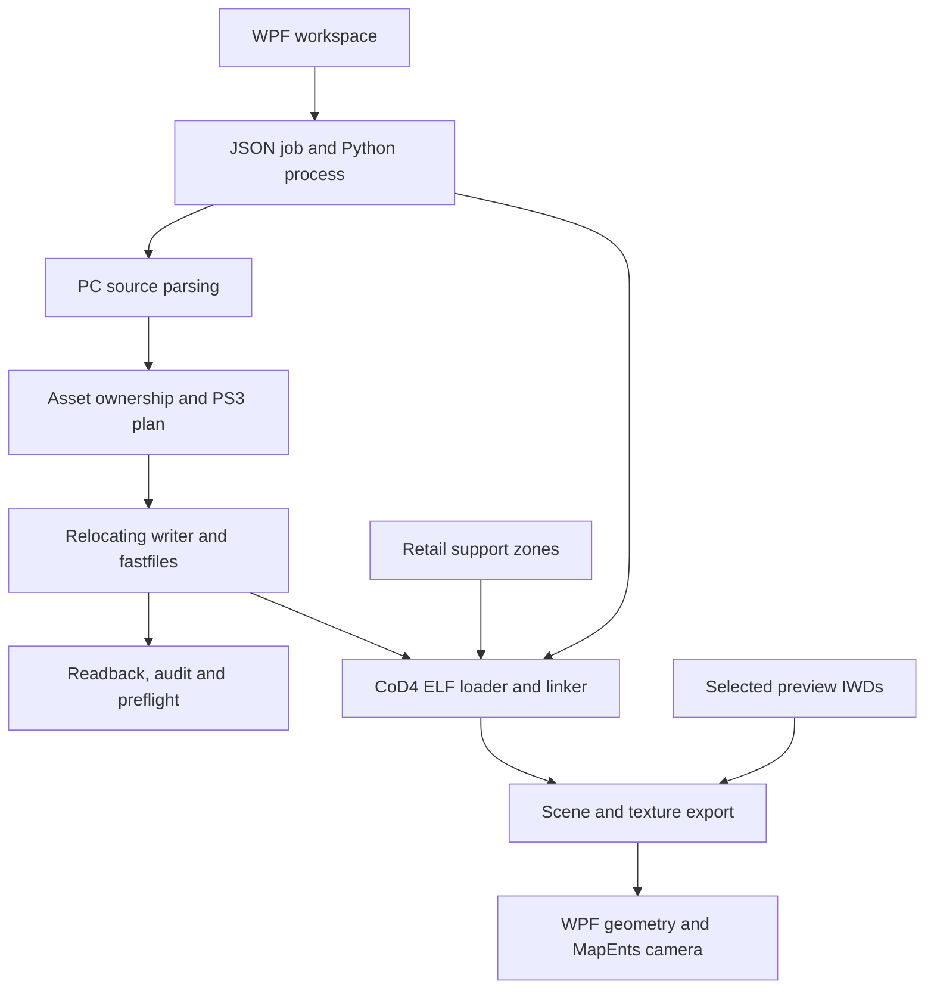

# Inside IW3MapPorter

[Back to README](../README.md)

The desktop is a C#/WPF host for the Python porter and the included PPC loader/linker.
The conversion core remains Python. The renderer consumes a compact scene exported
from linked PS3 memory; it does not load arbitrary Python objects into the UI.

## Processing paths



Conversion and linking are separate jobs. An existing PS3 map can enter the linking
path directly. A saved scene can enter the viewer without rerunning the emulator.

## Desktop shell

`MainWindow.xaml` defines the navigation and controls. `App.xaml` owns the shared
black theme; the explicit `AppWindowStyle` prevents derived windows from falling back
to a white background. `WindowTheme.cs` applies native dark title-bar attributes.
The same `Assets/IW3MapPorter.ico` is used in the header, window and executable.

`PorterSettings` stores paths and conversion policies using snake-case JSON. Validation
runs before a job. `InputDiscovery` normalizes map stems, download suffixes and optional
IWD `mp_` prefixes. It leaves ambiguous companions for the user to select.

`BackendRunner` starts a Python process with structured arguments, streams stdout and
stderr, writes a session log and enforces cancellation. A zero process exit code by
itself is insufficient: the runner requires a terminal protocol result.

## Job protocol

`backend/gui_bridge.py --request <request.json>` accepts a request containing:

```json
{
  "schema_version": 1,
  "command": "doctor",
  "settings": {},
  "output_dir": "C:/Maps/diagnostics/run-001"
}
```

Commands include `doctor`, `tests`, `analyze`, `port`, `verify`, `emulate`, `link` and
`preview`. The adapter emits one JSON object per line. `log` and `stage` update the
UI; `artifact` registers a file; `result` closes the job with a status and message.
`passed` applies to the stated check. `unproven` preserves the distinction between
successful software checks and untested PS3 loading. `failed` must not be displayed
as success because some intermediate files happen to exist.

Each desktop run has an isolated output directory. Configuration, ordinary run folders
and caches default to `%LOCALAPPDATA%\IW3MapPorter` unless an output root is selected.

## Conversion core

| Stage | Main modules | Responsibility |
| --- | --- | --- |
| Fastfile input | `backend/v4_ffio.py` | Decode the PC container and XAsset list. |
| Typed source parsing | `pc_clipmap.py`, `pc_gfxworld.py`, `pc_xmodel.py`, `pc_material.py`, `pc_fx.py` | Consume known structures, validate pointer/count shapes and recover owned asset data. |
| Image input | `backend/v4_iwd.py`, `assets/image.py` | Read IWI v6 mip layouts; prepare supported PS3 resources. |
| Source plan | `source_plan.py`, `material_planning.py`, `image_alias_replay.py` | Resolve material/image identities, asset aliases and ownership. |
| Assembly | `assembler.py`, `plan.py`, `graph.py` | Build typed destination nodes and their dependencies. |
| Serialization | `zone_writer.py`, `assets/*`, `xmodel.py` | Write big-endian data, resolve pointers and track logical block allocations. |
| Budget | `ps3_budget.py`, `porter.py` | Project memory use, select resource policies and optionally drop image mip levels. |
| Container/output | `main_ff.py`, `load_zone.py`, `porter.py` | Package the main/loading fastfiles and detailed reports. |
| Verification | `readback.py`, tools for audit and preflight | Reread saved data, verify payload/relocation evidence and check constraints. |

PC structures and PS3 structures are not generally byte-swap equivalents. Examples
include XSurface streams, AABB sizes, model placements and platform material state.
Writers explicitly construct the supported destination layouts.

### Pointers and blocks

The serialized byte cursor and logical allocation cursor are separate. A normal
block can accumulate data while TEMP allocations restart with their owning frame.
Runtime reservations consume logical space without inserting physical source bytes.

| Marker / concept | Meaning |
| --- | --- |
| Null | No referenced object. |
| `FOLLOWING` | Inline data consumed at the current physical stream position. |
| `INSERT` | Inline ownership with a registered alias cell. |
| Packed pointer | A block index and offset, relocated to a known destination allocation. |
| Symbol | Stable identity used to resolve a destination pointer. |

`RelocatingZoneWriter` records symbols, relocations, block high-water marks and
optional trace data. Resource policies choose embedded versus delayed pixel storage;
the delayed FIFO is emitted in its declared order. Unknown ownership must produce
an explicit failure or a documented policy result, not a guessed pointer.

### Source limits

PC and CoD4 PS3 GfxPortal records are `0x44` bytes. The verified PS3 loader at
`0xC54B0` resolves the neighbour cell at `+0x20` and reads vertices through `+0x24`
with the count at `+0x28`. `gfxworld_portals.py` proves a unique PC cell-array base;
`assets/gfxworld.py` emits big-endian planes/vertices/hull axes and PS3 cell relocations.
Transient writable portal state is cleared. Ambiguous neighbour pointers fail closed.

Runtime reservations follow the real loader order, including nested material allocations.
GfxTexture runtime entries are 24 bytes, draw surfaces are 8 bytes, and DPVS visibility
and LOD arrays contain 32-bit words aligned to 128 bytes. Their counts are visibility
word counts, not the number of models or surfaces. These allocations occupy block 1
without consuming serialized payload bytes.

The Impact-FX parser searches for exact inline table-pointer markers before attempting
full validation. It preserves overlapping and unaligned occurrences, header checks,
asset types and complete table cardinality. This avoids two pointer decodes for
every byte of a large map.

## Loader and linker

`tools/ps3_loader_emulator` contains the PPC interpreter, ELF access, stream loader,
shared database machine and link checks. Addresses belong to one fixed CoD4 profile.
The ELF and retail support zones are external inputs.

`gui_emulator.py` validates the ELF shape, builds/reuses a support snapshot and invokes
the linker. Its export callback reads the same machine that linked the assets.
`worldview.py` reads GfxWorld positions, surfaces, placements and entity strings.
`read_models` limits work to referenced models and the displayed LOD.

Two caches serve different purposes:

- **Support cache:** an emulated database after the three retail zones are loaded.
- **Scene cache:** a completed scene, textures and original linker report.

The scene key includes map, ELF, support data, selected IWD contents, report and backend
hashes. Files are staged, hashed and committed together. A partial or corrupted scene
is ignored. `preview-timings.json` records phases even when the job fails.

## Geometry and materials

`gui_scene.py` writes `world.scene.json` plus `world.scene.bin`. Scene v2 uses
`IW3SCN2\0`, a material-group count and, per group: RGBA fallback color, vertex/index
counts, float32 positions, float32 UVs and uint32 triangle indices. JSON maps group
numbers to PNG filenames and stores bounds, entities and diagnostics.

World UVs come from GfxWorld layer records. XModel UVs come from the secondary PS3
XSurface stream: two big-endian half floats at `+4` within each 16-byte vertex.
Model surface material handles are read from the linked XModel; instance placement
transforms positions while preserving UVs. Missing UVs remain a separate fallback
group rather than disabling another textured model group.

`gui_materials.py` examines diffuse bindings for both world and model materials.
It verifies generated fastfile/mip hashes before decoding PS3 image resources. When
those are unavailable, `gui_texture_sources.py` lazily reads exact-name images from
the selected IWDs. Conflicting image copies are rejected. The report distinguishes
`ps3-fastfile` from `pc-iwd-preview` and lists materials still missing a diffuse image.

Repeated images are decoded once. PNG alpha is preserved. `SceneDocument.cs` builds
WPF geometry in batches, tiles image brushes and reuses texture materials. WPF
lighting and transparency are previews; complete engine shaders, alpha testing,
lightmaps, animated materials and FX simulation remain outside this renderer.

## Entity navigation

`entity_parser.py` reads quoted MapEnts properties, preserving source strings. Valid
finite origins become camera targets. It converts three-component `angles` and the
single `angle` field, including the special vertical values. The desktop filters the
entity list, applies the eye-height offset and maintains free movement around the
selected entity. Missing/invalid origins never become fabricated camera locations.

## RSX source integration

Imported IW4Studio code lives under `Core/Vendor/IW4Studio`. `RsxInspector` exposes
instruction decoding and packed-vector/remap calculations. The pinned source hashes
and adaptations are in `IW4Studio-source.json`; the original MIT license is retained.
These reusable calculations do not establish compatibility of IW4 renderer bindings
with CoD4's engine structures.

## Extending the project

- For a new binary asset, add a typed source parser, destination node and focused
  regression fixtures. Check ownership, byte boundaries and readback before enabling it.
- For a preview texture format, update the decoder and add known pixel/channel tests.
  Add any new texture inputs to the scene cache identity.
- For desktop settings, update `PorterSettings`, validation, the bridge options and UI.
- For another EBOOT build, supply an explicit verified address/layout profile. Do not
  infer support from the ELF header alone.
- For a release, edit root `VERSION` and run `tools/release.ps1`. Build metadata and
  filenames are derived from that value.

The project keeps current documentation in `docs`, current verification in `validation`
and build output under `artifacts`. Historical release notes and generated build
intermediates are not part of the source release.


## Native material registration checks

Version 22.1.2 runs the material registration routine rather than replacing it
with a no-op. Named constants are checked before entering its unbounded lookup.
The interpreter supports the `lfs`/`lfd` loads and `fcmpu` comparisons exercised
by that routine, with tests for signed zero, NaN, negative displacements and CR
field isolation. FPSCR exception handling and general floating arithmetic remain
outside its scope. Instruction semantics were checked against IBM's
[floating-point load documentation](https://www.ibm.com/docs/ssw_aix_71/assembler/idalangref_point_load.html)
and [fcmpu reference](https://www.ibm.com/docs/en/aix/7.2.0?topic=set-fcmpu-floating-compare-unordered-instruction).

The CRC-32 helper is accelerated only when the executable's function body matches
the verified SHA-256. This preserves native material decisions while avoiding
interpreting every checksum bit. It does not replace GPU shader execution.


## Diagnostic coverage in Version 22.1.3

`gui_bridge.verification_failures` preserves the independent structural and
preflight verdicts. Failed IDs with their actual and expected values appear
in `*.verification-failures.json`, the live log and the final message.
A preflight pass with no support-zone inputs explicitly leaves native dependency
availability unchecked. Even with support files, string presence does not prove
a correctly typed database entry or GPU compatibility.

After native linking, `worldcheck.validate_world` bounds the world index, vertex,
layer, surface and static-model buffers against declared zone memory. It checks
triangle index ranges and registered material/XModel references before exporting
a scene. `materialcheck` also validates type-2 sampler hashes required by the
selected graph. These checks do not execute GPU shaders or complete game startup.

The new Nuked/Getaway uploads pass unchanged. Separate `CM_LoadMap` executions
passed using a substitute allocator; that investigative result is not a physical
console memory test and is not part of the desktop's automatic startup coverage.

`gui_bridge.native_verification` invokes `gui_emulator.execute('validate', ...)`
after successful saved-file audits for both conversion and verification jobs.
It overrides the map/fastfile selection with the audited output pair. Validation
shares support snapshots and `linkcheck` with the viewer but supplies no scene
export callback. Exceptions fail the job; missing prerequisites or blocked audits
produce explicit coverage records. No setting enables full game startup.

`scriptcheck` masks comments and literals before following named namespaces,
includes and function declarations case-insensitively. It separately scans literal
asset requests with source/line attribution. The stock FX `nil` assignment is
excluded. Missing declarations/assets remain candidates because optional branches,
dynamic dispatch, runtime builtins and target filesystem files are not evaluated.
Malformed GSC rawfiles and native default substitutions are exposed in the report
and final message. Scene caches include backend source hashes and retain that report.


## FX count accounting in Version 22.1.4

The structural audit filters the exact `FX packed visuals` deficit only if
nonnegative integer closure counts prove `source = exact + runtime fallbacks`.
It preserves the strict semantic FX checks and closure failure for full-fidelity
verification. An unaccounted deficit remains structural. The assembler records
per-visual fallback locations in `assembly_diagnostics.fx_visual_fallbacks`.
This changes diagnostics and classification, not serialization or alias resolution.


## PhysPreset sound-prefix contract in Version 22.1.5

`PhysPreset.sndAliasPrefix` at root offset `0x1C` must reference a readable XString
during physics sound initialization. NULL is distinct from a pointer to `""`:
the native caller compares/dereferences the pointer, while its sound setup helper
has a separate empty-string branch. The root writer always emits FOLLOWING and
all three ownership paths write the corresponding string payload. Readback
checks the top-level marker and bytes; `physicscheck` validates linked inventory.
Unresolved packed source identities use an explicit empty-prefix fallback and
remain visible as fidelity debt. The fix does not insert source Sound assets.

## Texture library and identity

`texture_library.py` selects IWD archives from the configured PC main folder.
Only exact image names required by the material graph or known image assets are
read from these archives. Explicit map images have priority. Unused stock images
and sounds are not imported. `visual_diagnostics.py` writes source-pixel coverage;
engine images and generated neutral images are listed separately from missing pixels.

The port report stores per-material texture-slot index, semantic, sampler hash and
image identity. `gui_materials.py` uses these only when the report's FastFile hash
matches the selected file. This lets it recover source pixels when linked memory
contains a default image. Scene-cache identity includes all selected archive hashes.
The actual PS3 files must be rebuilt separately to incorporate new source pixels.

## Shared material alignment

Material handle arrays are four-byte aligned, but their constant tables use absolute
16-byte alignment. Image-owner reconstruction evaluates the four legal base
residues, then requires independent pointer matches and a unique causal assignment.
Proven owner bases also resolve backward model-material references. Inline
PhysPreset roots occupy TEMP; their bounded name and sound-prefix strings contribute
to persistent B4 replay. The enclosing interval must still close at an independent
upper anchor before its predicted image cells become authoritative.
